## AWS Identity and Access Management

* Login as root user
 * Create policies first
    * Click policy - select a service (EC2) - Manual action (tick all EC2 box) as shown below 
 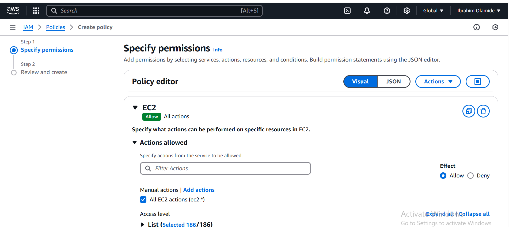
 
    * Resources (click all) as shown below 
    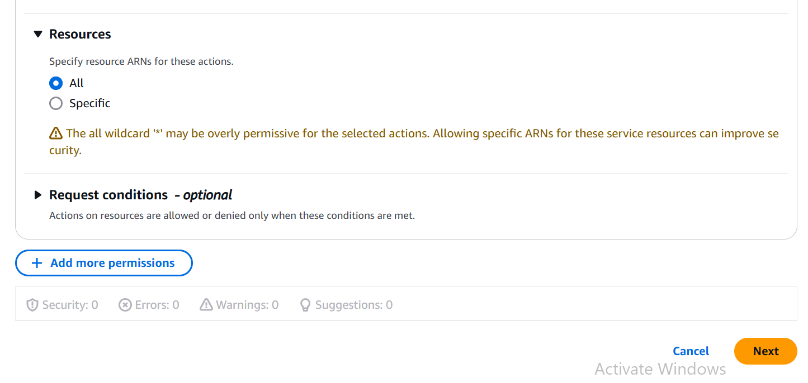

    * click next to go to next page - input policy name (Developers) - give description (This allows developers access EC2 instance) as shown below
    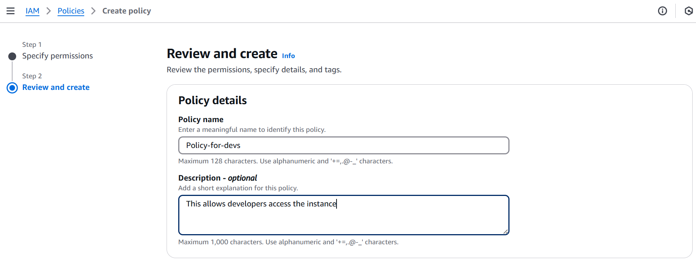

    * Click create policy.
    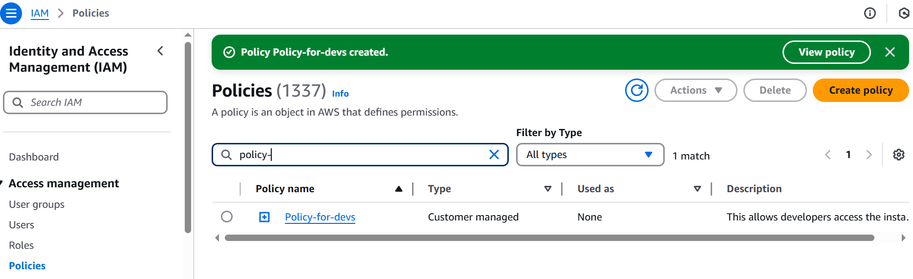

* Create group for the developers
    * Click user groups - create group - Enter user group name (Dev-team) - add users (Rokeeb) to the group
    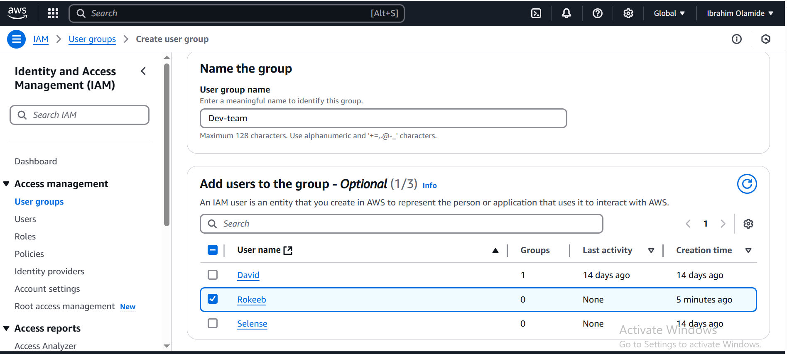

    * Add a policy for this user group. Add Devs policy that was just created, policy-for-devs
    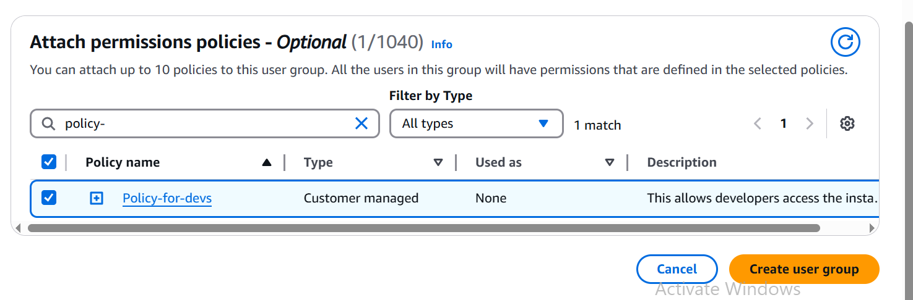

    * Click create user group
    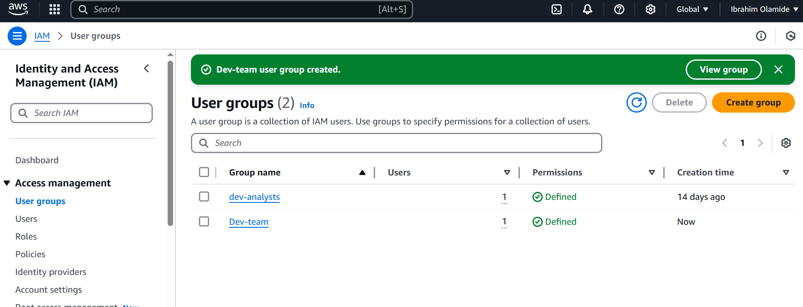

* Creating Iam User for Rokeeb
    * Select users - click create user - type in the username (Rokeeb) - tick the box, provide user access to AWS management console - tick the box, I want to create an Iam user - console password
    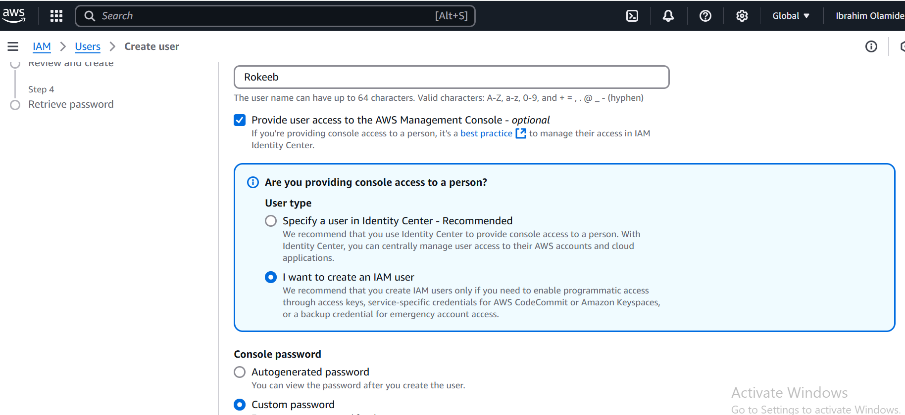

    * After setting up password, click next. Then select attach policy directly - filter by type, chosose customer managed. Then search for your policy created earlier (policy-for-devs) and select. 
    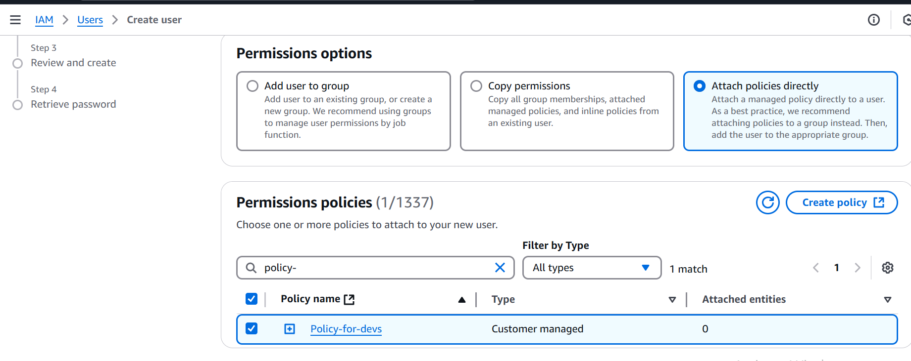

    * Then click next to review and create
    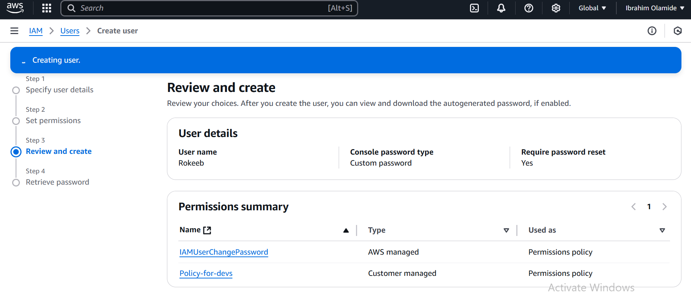

    * Then create user
    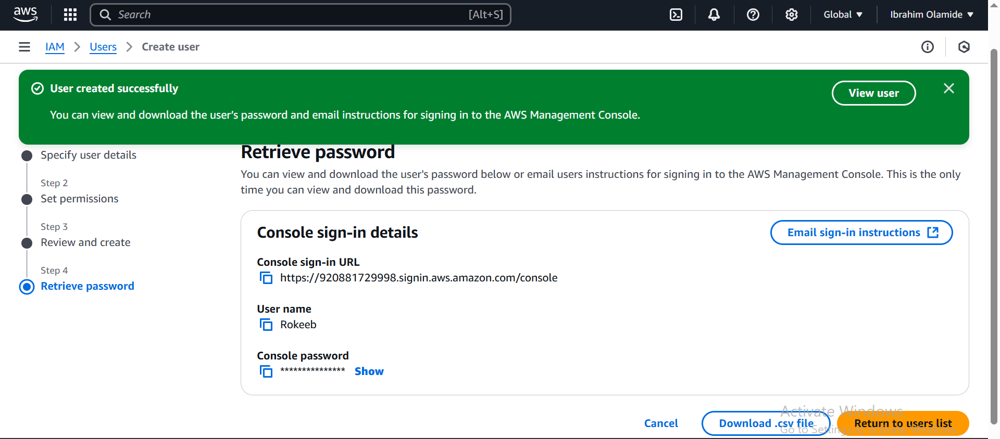

* Created another user, Abbey and added to the Dev-team group
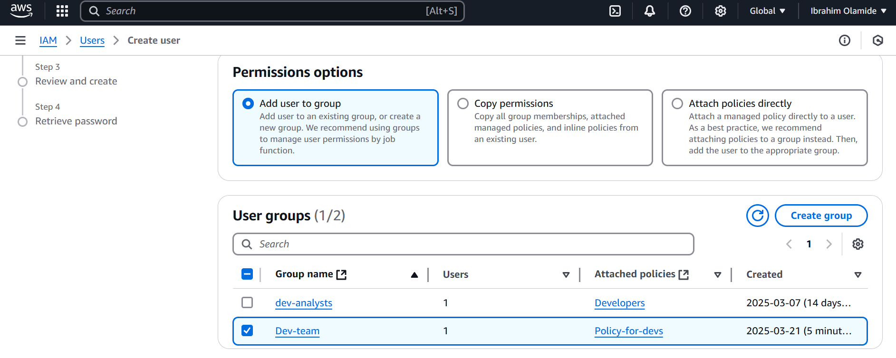
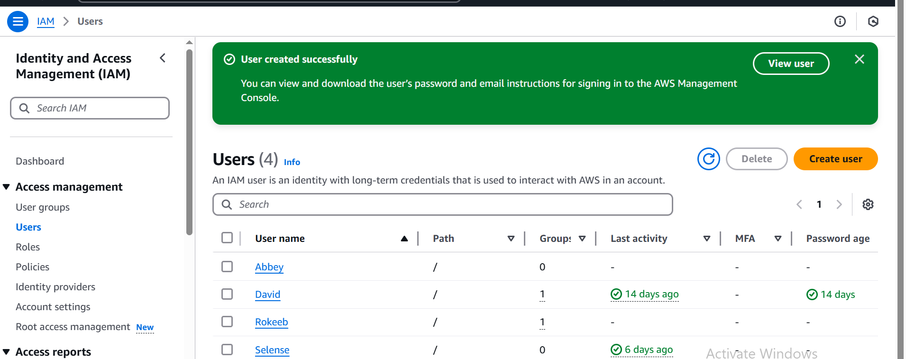

     